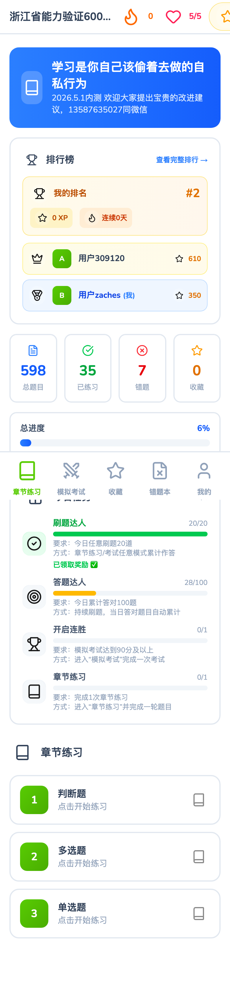
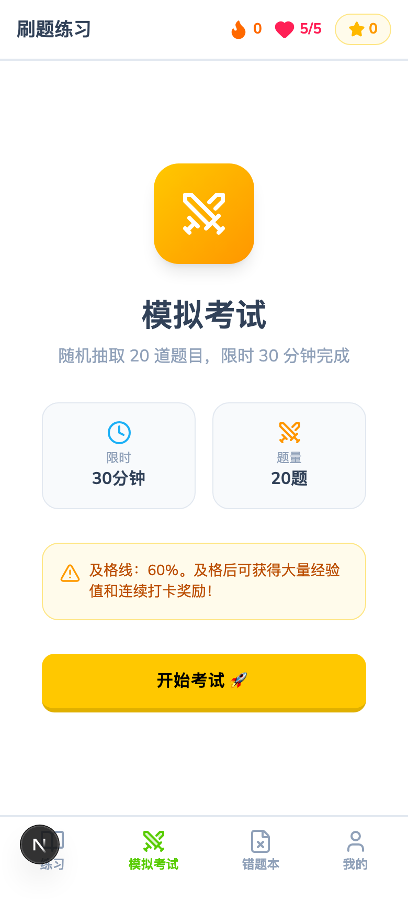
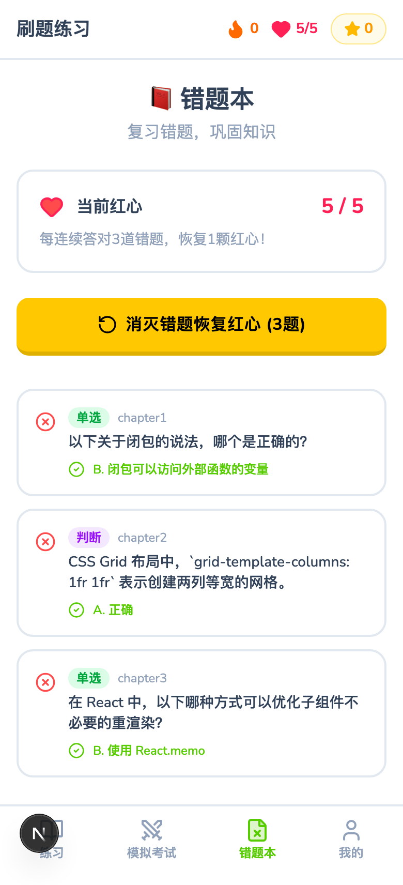
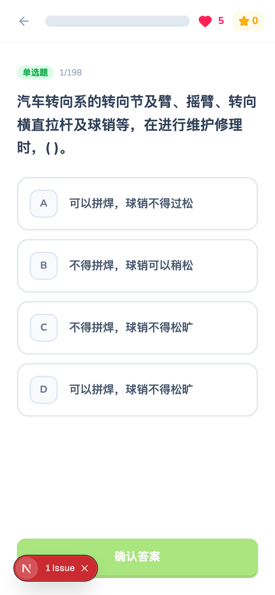

# 🐣 刷题练习 - Duolingo Style

一款仿 Duolingo 风格的游戏化刷题 Web 应用，让备考变得有趣高效。基于浙江省能力验证 600 道题库，支持章节练习、模拟考试、错题复习、收藏管理等功能，融入经验值、连胜打卡、成就系统和每日任务等游戏化机制。

## 📸 项目截图

| 首页-学习 | 模拟考试 |
|:---:|:---:|
|  |  |

| 错题本 | 我的 |
|:---:|:---:|
|  |  |

| 答题页面 |
|:---:|
|  |

## ✨ 功能特性

### 📚 章节练习
- 按题型章节分类（单选题、多选题、判断题）
- 每次练习随机出题，答完即出结果
- 答对获得 10 XP 经验值

### ⚔️ 模拟考试
- 随机抽取 50 道题，每题 2 分，满分 100 分
- 限时 60 分钟，及格线 90 分（需答对 45 题）
- 及格奖励 200 XP + 连胜天数 +1
- 考试结果页展示得分、经验值和连胜信息

### ❌ 错题本
- 自动记录答错的题目
- 支持错题回血挑战：每连续答对 3 道错题恢复 1 颗红心
- 显示正确答案和题目解析

### ⭐ 收藏夹
- 答题时可收藏有价值的题目
- 支持批量练习收藏题目
- 可取消收藏

### 🏆 排行榜
- 按经验值排名，展示前 50 名
- 显示用户排名、XP、连胜天数、模拟考试最高分
- 前三名特殊样式（金银铜）

### 🎯 成就系统
- 100 个等级成就，从"初出茅庐"到"满级大佬"
- 每获得 100 XP 自动解锁下一个成就
- 个人页展示成就墙

### 📋 每日任务
- 4 个每日任务：开启连胜、章节练习、答题达人、刷题达人
- 完成任务可领取 50-100 XP 奖励
- 任务进度实时追踪

### 👤 用户系统
- 邮箱注册/登录（Supabase Auth）
- 忘记密码/重置密码
- 红心机制（5 颗红心，答错消耗，错题回血恢复）
- 连胜打卡记录
- 个人学习统计

## 🛠 技术栈

| 类别 | 技术 |
|------|------|
| 前端框架 | Next.js 16 (App Router) |
| UI 库 | React 19 |
| 样式 | Tailwind CSS 4 |
| 动画 | Framer Motion |
| 状态管理 | Zustand |
| 数据库 & 认证 | Supabase (PostgreSQL + Auth) |
| UI 组件 | Radix UI (Dialog, Progress) |
| 图标 | 自定义 PNG 图标 + Lucide React |
| 通知 | Sonner |
| 语言 | TypeScript 5 |

## 🚀 本地开发

### 环境要求

- Node.js 18+
- npm 或 pnpm
- Supabase 账号（用于数据库和认证）

### 安装步骤

```bash
# 克隆仓库
git clone https://github.com/<your-username>/duolingo-shuati.git
cd duolingo-shuati

# 安装依赖
npm install

# 配置环境变量
cp .env.example .env.local
```

### 环境变量

在 `.env.local` 中配置以下变量：

```env
NEXT_PUBLIC_SUPABASE_URL=your_supabase_url
NEXT_PUBLIC_SUPABASE_ANON_KEY=your_supabase_anon_key
NEXT_PUBLIC_SITE_URL=https://your-domain.com
```

**重要提示**：
- `NEXT_PUBLIC_SITE_URL` 必须设置为你的实际访问域名（例如：`https://tk.your-domain.com`）
- 此配置用于 Supabase Auth 的回调链接（邮件确认、密码重置等）
- 如果不配置，邮件中的链接会指向 `http://localhost:3000`，导致外部用户无法正常使用

### 数据库初始化

按顺序执行 Supabase SQL Editor 中的脚本：

1. `supabase-schema.sql` — 创建表结构和 RLS 策略
2. `supabase-seed.sql` — 导入题库数据
3. `supabase-migration.sql` — 执行迁移（成就系统、每日任务等）

### 启动开发服务器

```bash
npm run dev
```

访问 [http://localhost:3000](http://localhost:3000) 查看应用。

## 📊 数据库设计

### 表结构

| 表名 | 说明 |
|------|------|
| `questions` | 题库表（章节、题型、内容、选项、答案、解析） |
| `user_progress` | 用户进度（红心、XP、连胜、最高考试分、章节正确数） |
| `user_actions` | 答题记录（对错、错题标记、收藏标记） |
| `user_achievements` | 成就解锁记录 |
| `user_daily_tasks` | 每日任务进度 |

### 核心函数

| 函数 | 说明 |
|------|------|
| `get_leaderboard(limit)` | 获取排行榜（按 XP 降序） |
| `add_xp(user_id, amount)` | 增加用户经验值 |

### 安全策略

所有用户数据表启用 Row Level Security (RLS)，用户只能读写自己的数据。`questions` 表所有人可读。

## 📐 开发需求文档

### 项目背景

面向需要备考浙江省能力验证考试的用户，提供游戏化刷题体验。通过 Duolingo 风格的 UI 和游戏机制（经验值、红心、连胜、成就），降低刷题枯燥感，提高学习积极性。

### 用户角色

| 角色 | 说明 |
|------|------|
| 普通用户 | 注册登录后使用全部刷题功能 |
| 管理员 | 通过 `/admin` 页面管理题库 |

### 功能模块需求

#### M1: 用户认证
- 邮箱 + 密码注册
- 邮箱 + 密码登录
- 忘记密码 / 重置密码
- Supabase Auth 回调处理
- 中间件保护需登录页面，已登录用户自动跳转

#### M2: 学习模块（首页）
- 展示题库信息（名称、总题量）
- 统计面板（总题目、已练习、错题、收藏）
- 总进度条
- 章节列表（单选题、多选题、判断题）
- 排行榜预览（前 5 名 + 我的排名）
- 每日任务面板

#### M3: 答题模块
- 支持单选题、多选题、判断题三种题型
- 答题后即时反馈（对/错 + 正确答案 + 解析）
- 答错扣 1 颗红心，红心为 0 时无法继续答题
- 答对获得 10 XP
- 支持收藏题目
- 支持退出确认弹窗

#### M4: 模拟考试模块
- 随机抽取 50 题，每题 2 分，满分 100
- 限时 60 分钟
- 及格线 90 分
- 及格奖励：200 XP + 连胜 +1 天
- 考试结果页：得分、答题经验、及格奖励、连胜信息
- 及格时触发撒花动画

#### M5: 错题本模块
- 自动收集答错的题目
- 展示错题列表（题型标签 + 题目内容 + 正确答案）
- 错题回血挑战：重新答错题，每连续答对 3 题恢复 1 颗红心
- 回血结果页展示恢复红心数

#### M6: 收藏夹模块
- 答题时一键收藏/取消收藏
- 收藏列表展示（题型标签 + 题目 + 答案 + 解析）
- 支持批量练习收藏题目
- 支持取消收藏

#### M7: 排行榜模块
- 按经验值降序排名，展示前 50 名
- 前三名金银铜特殊样式
- 显示用户昵称、XP、连胜天数、模拟考试最高分
- 我的排名卡片

#### M8: 成就系统
- 100 个等级成就，每 100 XP 解锁一个
- 解锁时弹出成就弹窗
- 个人页成就墙展示（已解锁/未解锁）

#### M9: 每日任务系统
- 4 个每日任务：
  - 开启连胜：考试 ≥ 90 分
  - 章节练习：完成 1 次章节练习
  - 答题达人：今日累计答对 100 题
  - 刷题达人：今日任意刷题 20 道
- 任务完成可领取 XP 奖励（50-100 XP）
- 任务进度实时追踪

#### M10: 个人中心模块
- 用户信息卡片（昵称、XP、连胜、红心、答对数）
- 每日任务面板（含领取奖励按钮）
- 成就墙
- 快捷入口（章节练习、模拟考试、排行榜、错题本）
- 学习统计
- 退出登录

### 非功能性需求

| 需求 | 说明 |
|------|------|
| 响应式设计 | 移动端优先，适配手机/平板/桌面 |
| 动画体验 | Framer Motion 页面切换和交互动画 |
| 数据安全 | RLS 行级安全策略，用户数据隔离 |
| 性能 | Next.js SSR + 客户端状态管理，首屏快速加载 |
| 可访问性 | 语义化 HTML，合理的颜色对比度 |

## 🚢 部署指南

### 腾讯云 EdgeOne Pages 部署（推荐）

EdgeOne Pages 是腾讯云推出的边缘全栈部署平台，支持 Next.js SSR 全栈部署，无需自建服务器。

1. **推送代码到 GitHub**

```bash
git push origin main
```

2. **创建 EdgeOne 站点**
   - 登录 [腾讯云 EdgeOne 控制台](https://console.cloud.tencent.com/edgeone)
   - 点击「新建站点」，输入你的域名（如 `your-domain.com`）
   - 选择 NS 接入方式
   - 将域名的 NS 记录修改为 EdgeOne 分配的名称服务器

3. **导入 GitHub 仓库到 EdgeOne Pages**
   - 进入 [EdgeOne Pages 控制台](https://edgeone.cloud.tencent.com/pages)
   - 点击「创建项目」→「导入 Git 仓库」
   - 授权 GitHub 并选择你的仓库
   - 框架预设选择 **Next.js**（自动检测）
   - 构建命令：`npm run build`
   - 输出目录：`.next`
   - 添加环境变量：
     - `NEXT_PUBLIC_SUPABASE_URL`
     - `NEXT_PUBLIC_SUPABASE_ANON_KEY`
     - `NEXT_PUBLIC_SITE_URL=https://your-custom-domain.com`（替换为你的实际域名）
   - 点击「部署」

4. **绑定自定义域名**
   - 部署成功后，在「项目设置」→「自定义域名」中添加子域名（如 `tk.your-domain.com`）
   - 按提示添加 CNAME 记录指向 EdgeOne 分配的地址
   - 等待 SSL 证书自动签发

5. **验证访问**
   - 通过自定义域名访问应用，确认功能正常

### 自建服务器部署

1. **构建项目**

```bash
npm run build
```

2. **启动服务**

```bash
npm run start
```

3. **使用 Docker 部署**

```dockerfile
FROM node:18-alpine
WORKDIR /app
COPY package*.json ./
RUN npm ci
COPY . .
RUN npm run build
EXPOSE 3000
CMD ["npm", "start"]
```

4. **配置 EdgeOne CDN 加速**
   - 在 EdgeOne 控制台创建站点
   - 配置源站为你的服务器地址
   - 绑定域名并开启 HTTPS

## 📁 项目结构

```
duolingo-shuati/
├── public/icons/          # 自定义 PNG 图标
├── screenshots/           # 项目截图
├── scripts/               # 工具脚本（题库导入、SQL 生成等）
├── src/
│   ├── app/
│   │   ├── (main)/        # 主布局页面
│   │   │   ├── exam/      # 模拟考试
│   │   │   ├── favorites/ # 收藏夹
│   │   │   ├── leaderboard/ # 排行榜
│   │   │   ├── learn/     # 学习首页
│   │   │   ├── mistakes/  # 错题本
│   │   │   └── profile/   # 个人中心
│   │   ├── admin/         # 管理后台
│   │   ├── api/           # API 路由
│   │   ├── auth/          # 认证页面（登录/注册/重置密码）
│   │   └── lesson/        # 答题页面
│   ├── components/        # 组件
│   │   ├── modals/        # 弹窗组件
│   │   └── ui/            # UI 基础组件
│   ├── lib/               # 工具库
│   │   ├── supabase/      # Supabase 客户端和服务端操作
│   │   ├── constants.ts   # 游戏配置常量
│   │   └── types.ts       # TypeScript 类型定义
│   ├── store/             # Zustand 状态管理
│   └── middleware.ts      # 认证中间件
├── supabase-schema.sql    # 数据库 Schema
├── supabase-seed.sql      # 题库种子数据
└── supabase-migration.sql # 数据库迁移脚本
```

## 📄 License

Private - 仅供学习使用
